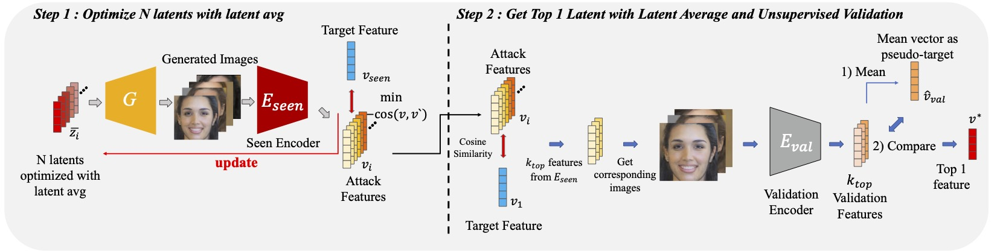

# Face Reconstruction Transfer Attack as Out-of-Distribution Generalization 
Official implementation of Face Reconstruction Transfer Attack as Out-of-Distribution Generalization (ALSUV)

<p align="center">  </p>

> [**Face Reconstruction Transfer Attack as Out-of-Distribution Generalization**](https://arxiv.org/abs/2407.02403),               
> Yoon Gyo Jung, Jaewoo Park, Xingbo Dong, Hojin Park, Andrew Beng Jin Teoh, Octavia Camps   
> *ECCV 2024 ([https://arxiv.org/abs/2407.02403](https://arxiv.org/abs/2407.02403))*    


## Installation
Setup environment
```shell script
conda create --name alsuv python=3.8 -y && conda activate alsuv
pip install -r requirements.txt
```

Download Dataset
Download each LFW, CFP-FP, and AgeDB_30 dataset and locate at ./dataset where the directory has the structure structure as below

    .
    ├── ...
    ├── dataset                        
    │   ├── agedb_30                    
    │   │   ├── FXZoo_algined           
    │   │   │   ├── 4ErnestHemingway
    │   │   │   └── ...
    │   │   ├── InsightFace_aligned     
    │   │   │   ├── 4ErnestHemingway
    │   │   │   └── ...
    │   │   └── mtcnn_aligned          
    │   │       ├── 4ErnestHemingway
    │   │       └── ...
    │   ├── cfp                             
    │   │   ├── Data                    
    │   │   │   ├── FXZoo_algined           
    │   │   │   │   ├── 001
    │   │   │   │   └── ...
    │   │   │   └── mtcnn_aligned          
    │   │   │       ├── 001
    │   │   │       └── ...
    │   │   └── Protocol                 
    │   │       ├── Split                 
    │   │       ├── Pair_list_F.txt                 
    │   │       └── Pair_list_P.txt            
    │   └── lfw                
    │       ├── FXZoo_algined           
    │       │   ├── Aaron_Eckhart
    │       │   └── ...
    │       └── mtcnn_aligned          
    │           ├── Aaron_Eckhart
    │           └── ...
    │
    └── ...


Download Model Checkpoints and locate them at ./encoder/weights
- <a href="https://drive.google.com/file/d/1eVq2hhjHiO494qkDcGhG5EdxYOilu--7/view?usp=share_link">VGGNet-19</a>
- <a href="https://drive.google.com/file/d/1pDOX9_bQAgSkJp8W-EVq4iKBg07gTQLE/view?usp=drivesdk">ResNet-50</a>
- <a href="https://drive.google.com/file/d/1BDDpjhUYCwQde6KzR2ztGkMqgE8Nq9E2/view?usp=share_link">SwinTransformer-S</a>

Download StyleGAN2-FFHQ256 checkpoint and locate at ./generator/weights
- <a href="https://drive.google.com/file/d/1W4ZmSxm3gROz205JoikqVeHRroM2_fXY/view?usp=share_link">StyleGAN2-FFHQ-256x256</a>


## Run
Generate
```shell script
python main.py --test False --dataset lfw-200
```

Test(Verification and Identification)
```shell script
python main.py --test True --dataset lfw-200
```


